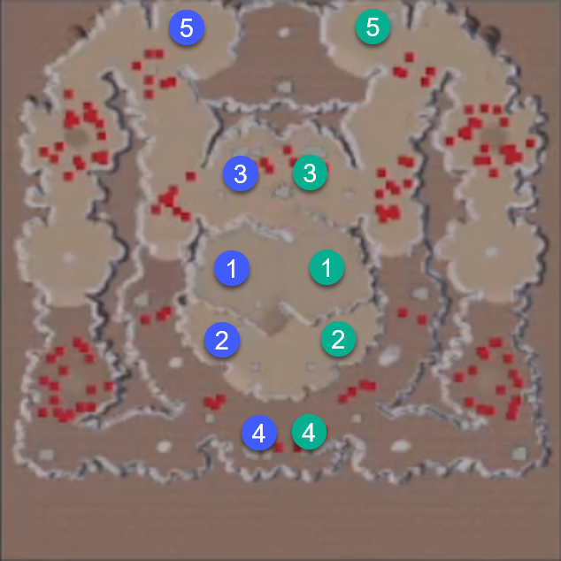
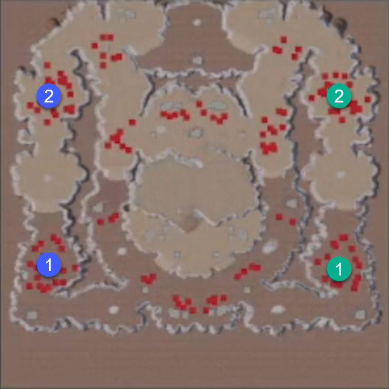
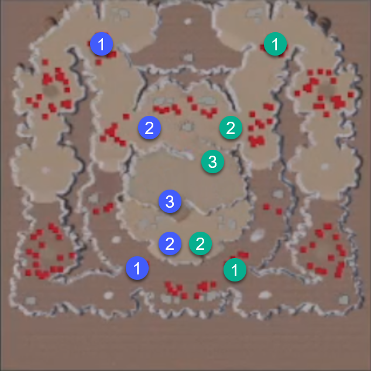
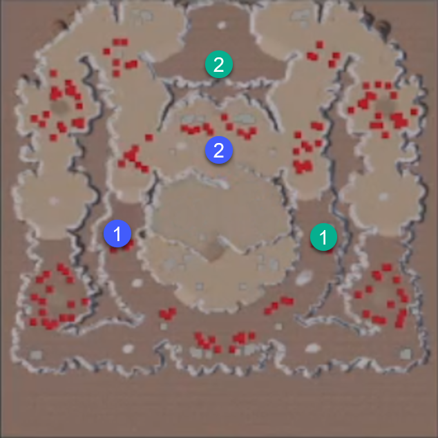
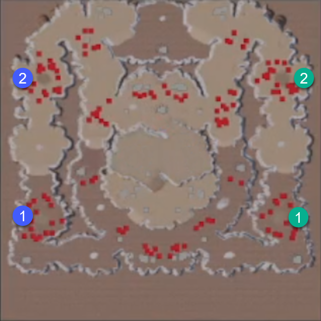

Information contained in this note is based on this <a href="https://www.youtube.com/watch?v=XkAgOCIz3DE">YouTube, Reference Video</a>.

**Open Bases**

On this map, you start with around 500 alloy and 100 ether. You are probably going to want to expand to the bases in the marked order, given the density of defending enemies shown on the minimap.

You should know that these are all standard bases that will mine out in 10 minutes. Giving a total of 18,000 alloy and 7,200 ether. Plus an additional 6,000 alloy from the starting Bastion. In the late game, you will have zero income, aside from pyre.

**Enemy Spawn Areas**

The first enemy wave will spawn at 1 minute, and every 2 minutes after will spawn a new wave. These waves are small, and won't be a threat until the 15-minute mark.

**Pyre Towers**

You have till then to take all 5 of your bases, and set a defensive line at the outer Pyre towers.

The spawn size post the 15-minute mark does become rather large. You may be tempted to fall back and abandon forward bases, but the waves will stack if not dealt with. Eventually, more units than the game can handle, so ensure outer pyre towers are held. Try to take them back if you lose them.

**Pyre Camps**

When you have the time you are also going to need to take the 4 pyre camps spread around the map. It will probably be ideal to split your army in half, to protect your two outer towers, and just have a small force of Ichors or Dervishes to clear the camps quickly.

**Multipliers**

If you have additional free time, you can take out the Altar of the Worthys on the edges of the map to double your current more multiplier: 2, 4, 8, to the max of 16. Amber Wombs will also spawn, with a pack of enemies to defend them. Killing an Amber Womb will increase your score, but also spawn random friendly and enemy units. With this spawning, it's possible to go past the supply cap.

But really, these optional objectives can be completely ignored, so you can just focus on surviving for as long as possible.